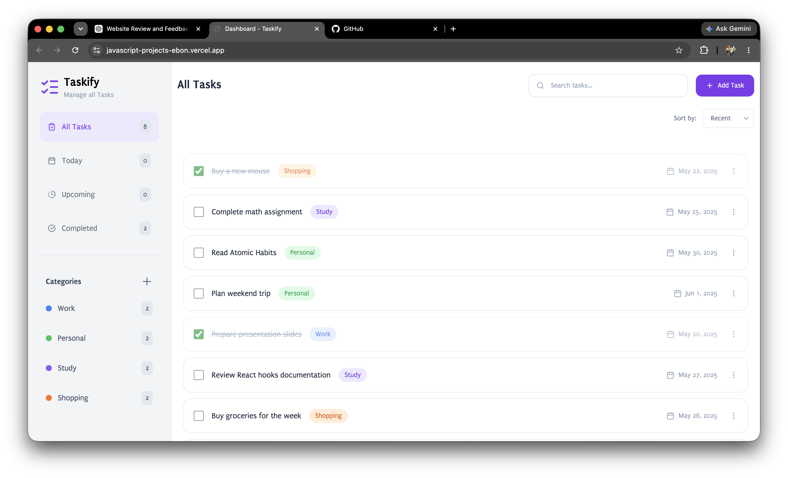
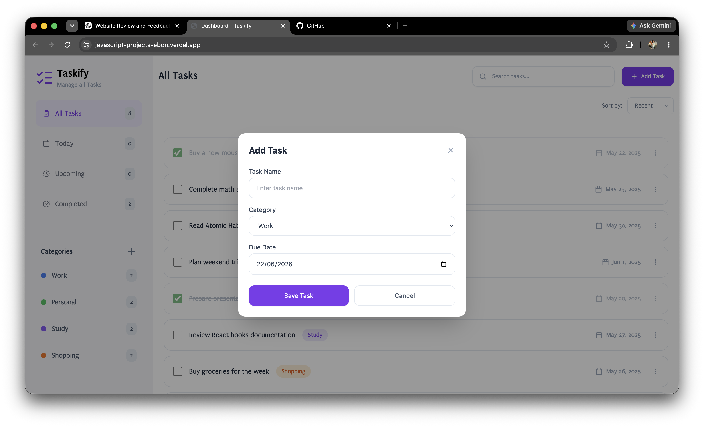

<div align="center">

# 📋 To-Do App

**A clean, modern task management application built with vanilla JavaScript and Tailwind CSS**

[](https://javascript-projects-ebon.vercel.app/dashboard.html)
[](https://developer.mozilla.org/en-US/docs/Web/HTML)
[](https://tailwindcss.com/)
[](https://developer.mozilla.org/en-US/docs/Web/JavaScript)
[](https://vercel.com)

</div>

---

## 🚀 Live Demo

Experience the app live: [To-Do App](https://javascript-projects-ebon.vercel.app/dashboard.html)

[](https://javascript-projects-ebon.vercel.app/dashboard.html)

---

## ✨ Features

- **Add Tasks** — Quickly create new tasks with a name, category, and due date via an intuitive modal form.
- **Mark as Completed** — Toggle task completion with a checkbox; completed tasks are visually distinguished with strikethrough styling.
- **Delete Tasks** — Remove unwanted tasks with a confirmation prompt to prevent accidental deletions.
- **Edit Tasks** — Update task name, category, or due date at any time through the edit modal.
- **Filter by Menu** — Switch between All Tasks, Today, Upcoming, and Completed views with a single click.
- **Filter by Category** — Click any category in the sidebar to view only tasks belonging to that group.
- **Search Tasks** — Real-time search filters tasks as you type.
- **Sort Options** — Sort tasks by Recent, A-Z, or Completed order.
- **Category Management** — Create custom categories with a color picker to organize tasks your way.
- **Responsive UI** — Full-screen layout with independently scrolling sidebar and content area.
- **Clean & Modern Design** — Gradient background, rounded cards, smooth transitions, and Lucide icons.

---

## 🛠️ Tech Stack

| Technology   | Purpose                        |
|-------------|--------------------------------|
| HTML5       | Structure and markup           |
| Tailwind CSS| Utility-first styling (CDN)    |
| JavaScript  | Application logic and DOM manipulation |
| Lucide Icons| Icon library for UI elements   |
| Google Fonts| Puritan font family            |
| Vercel      | Deployment and hosting         |

---

## 📸 Screenshots

### Dashboard



### Task Added



---

## 📁 Project Structure

```
To-Do_App/
├── dashboard.html          # Main application page
├── dashboard.css           # Custom styles (Puritan font faces)
├── dashboard.js            # Application logic (CRUD, filtering, modals)
├── vercel.json             # Vercel deployment configuration
├── screenshots/            # Screenshot assets
│   ├── dashboard.png
│   ├── task-added.png
│   └── mobile-view.png
└── README.md               # Project documentation
```

---

## 💻 Installation & Usage

To run the project locally:

```bash
# Clone the repository
git clone https://github.com/yourusername/To-Do_App.git

# Navigate to the project directory
cd To-Do_App

# Open the app in your default browser
open dashboard.html
```

No build tools or dependencies are required. The app uses Tailwind CSS via CDN, so an internet connection is needed for first load.

---

## 🔮 Future Improvements

- [ ] Local storage persistence for tasks and categories
- [ ] Drag-and-drop task reordering
- [ ] Due date reminders and notifications
- [ ] Dark mode toggle
- [ ] Subtask support within tasks
- [ ] Export tasks as CSV or PDF
- [ ] User authentication for multi-device sync

---

## 👨‍💻 Author

**Abhinav Mishra**

[](https://github.com/mabhinav1206)
[](https://linkedin.com/in/abhinavmishra1206)

---

<div align="center">

Built with ❤️ by Abhinav Mishra

</div>
